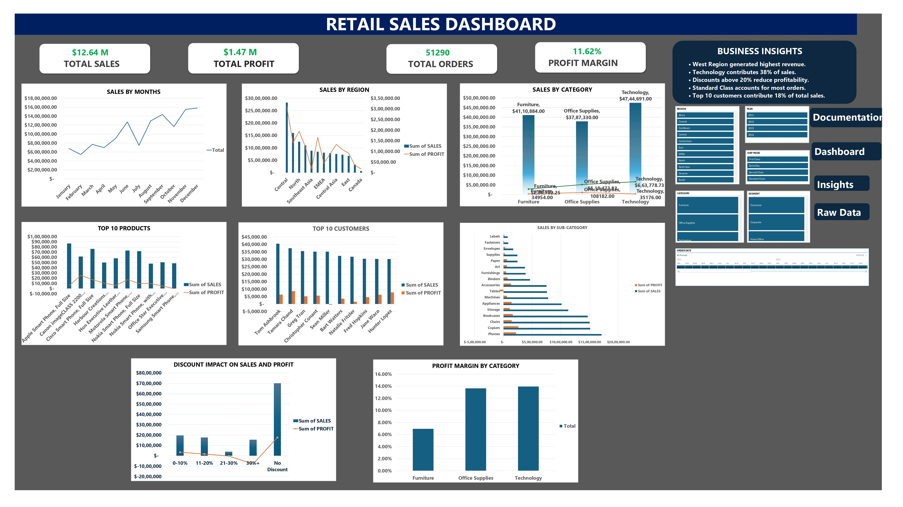
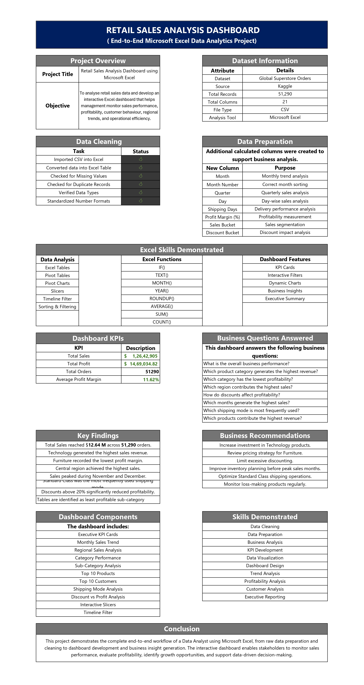
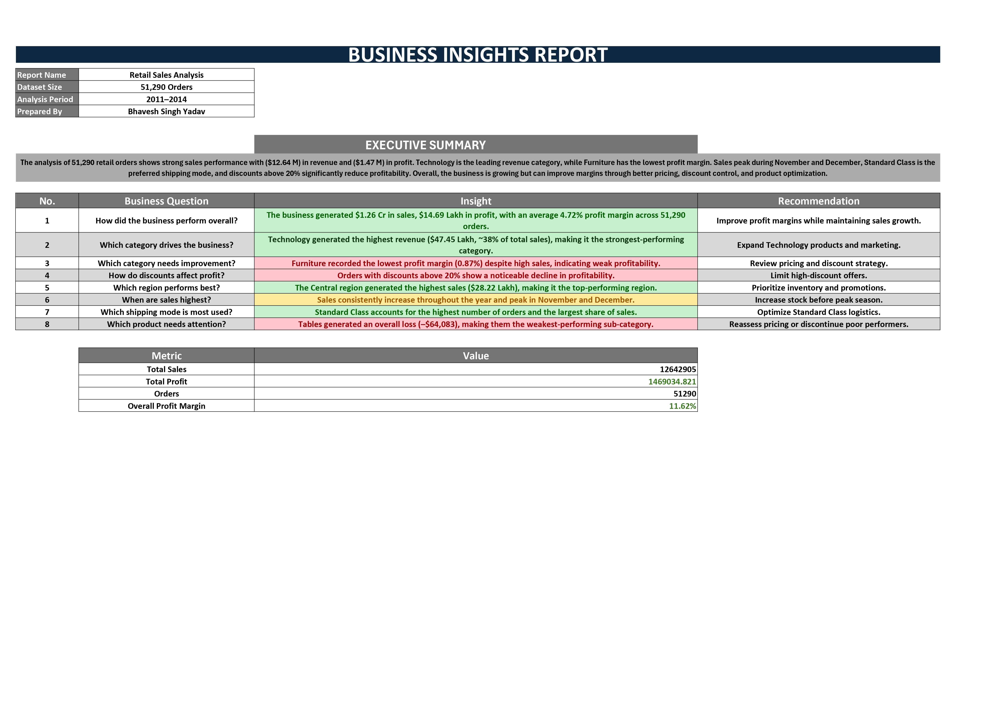
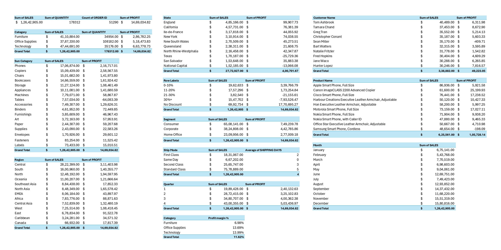

# 📊 Retail Sales Analysis Dashboard | Microsoft Excel

An end-to-end **Data Analysis Project** built in **Microsoft Excel** using the **Global Superstore** dataset. This project demonstrates the complete analytics workflow—from raw data cleaning and transformation to interactive dashboard creation and business insight generation.

---

# 📌 Project Overview

The objective of this project is to analyze retail sales performance and build an interactive dashboard that enables business users to monitor key performance indicators, identify sales trends, evaluate profitability, and make data-driven decisions.

---

# 🎯 Objectives

- Analyze retail sales performance.
- Measure business profitability.
- Identify high-performing products and customers.
- Evaluate regional sales trends.
- Analyze the impact of discounts on profit.
- Build an interactive Excel dashboard for executive reporting.

---

# 📂 Dataset Information

| Attribute | Details |
|-----------|---------|
| **Dataset** | Global Superstore Orders |
| **Source** | Kaggle |
| **Total Records** | 51,290 |
| **Total Columns** | 21 |
| **Tool Used** | Microsoft Excel |

---

# 🛠️ Excel Skills Demonstrated

### Data Preparation
- Data Cleaning
- Data Validation
- Duplicate Removal
- Data Formatting
- Calculated Columns

### Data Analysis
- Excel Tables
- Pivot Tables
- Pivot Charts
- Slicers
- Timeline Filters

### Excel Functions
- IF()
- TEXT()
- MONTH()
- YEAR()
- ROUNDUP()
- SUM()
- COUNT()
- AVERAGE()

### Dashboard Design
- KPI Cards
- Interactive Filters
- Business Visualizations
- Executive Reporting

---

# 📊 Dashboard Features

- ✅ Total Sales KPI
- ✅ Total Profit KPI
- ✅ Total Orders KPI
- ✅ Average Profit Margin KPI
- ✅ Monthly Sales Trend
- ✅ Regional Sales Analysis
- ✅ Category Performance
- ✅ Sub-Category Analysis
- ✅ Top 10 Products
- ✅ Top 10 Customers
- ✅ Shipping Mode Analysis
- ✅ Discount vs Profit Analysis
- ✅ Interactive Slicers
- ✅ Timeline Filter

---

# 📸 Dashboard Preview



---

# 📄 Project Documentation



---

# 💡 Business Insights



---

# 📑 Pivot Table Analysis



---

# 📈 Key Performance Indicators (KPIs)

| KPI | Value |
|------|-------:|
| **Total Sales** | ₹1,26,42,905 |
| **Total Profit** | ₹14,69,034.82 |
| **Total Orders** | 51,290 |
| **Average Profit Margin** | 11.62% |

---

# ❓ Business Questions Answered

- What is the overall business performance?
- Which product category generates the highest revenue?
- Which category has the highest and lowest profitability?
- Which region contributes the highest sales?
- How do discounts impact profitability?
- Which months generate the highest sales?
- Which shipping mode is used the most?
- Which products generate the highest revenue?
- Who are the top-performing customers?

---

# 🔍 Key Business Insights

- 💰 Total sales reached **₹1.26 Crore** across **51,290 orders**.
- 💻 Technology generated the highest sales revenue.
- 🪑 Furniture recorded the lowest profit margin.
- 🌍 Central region achieved the highest sales.
- 📈 November and December recorded the highest sales.
- 🚚 Standard Class was the most frequently used shipping mode.
- ⚠️ Discounts above **20%** significantly reduced profitability.
- 📉 Tables were the least profitable sub-category.

---

# 💼 Business Recommendations

- Increase investment in Technology products.
- Review pricing strategy for Furniture products.
- Reduce excessive discounting to improve profitability.
- Plan inventory before peak sales months.
- Optimize Standard Class shipping operations.
- Monitor low-profit products regularly.

---

# 📁 Repository Structure

```
Retail-Sales-Analysis-Excel
│
├── Cover_Page.png
├── Dashboard.png
├── Documentation.png
├── Insights.png
├── Pivot_Tables.png
├── Retail_Sales_Analysis_Dashboard.xlsb
├── README.md
└── LICENSE

----

# 🚀 Skills Demonstrated

- Microsoft Excel
- Data Cleaning
- Data Preparation
- Data Analysis
- Pivot Tables
- Pivot Charts
- Dashboard Development
- KPI Reporting
- Business Analysis
- Data Visualization
- Executive Reporting

---

# 👨‍💻 Author

**Bhavesh Singh Yadav**

Aspiring Data Analyst

**Skills:** Microsoft Excel • SQL • Power BI • Python

---

## ⭐ If you found this project useful, consider giving it a Star!

